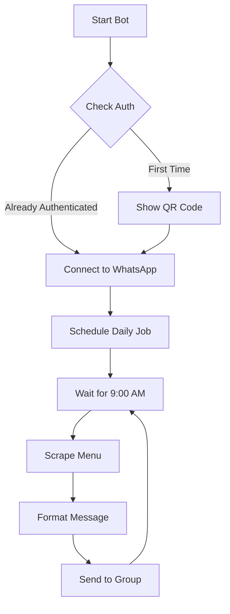

# Ulutek Menu Bot

A WhatsApp bot that automatically fetches and sends the daily menu from Ulutek's website to a specified WhatsApp group.

## 🌟 Features

- 🔄 Automatically fetches daily menu from Ulutek's website
- 📱 Sends menu to a specified WhatsApp group
- 🔌 Persistent WhatsApp connection (only need to scan QR code once)
- 🚀 Auto-startup with Windows
- 📅 Shows menu items with calories
- 🔄 Auto-reconnect on connection loss
- ⏰ Scheduled sending at 9:00 AM on weekdays
- 📊 Calorie tracking for each item

## 📋 Example Menu Format

```
📅 Pazartesi, 29 Ocak 2024
🍽️ Today's Menu:

🥣 Fesleğenli Domates Çorba (161 kcal)
🍖 Etli Ali Nazik (315 kcal)
🥗 Tavuklu Sultan Kebabı (390 kcal)
🍚 Arpa Şehriye Pilavı (456 kcal)
🍰 Tatlı Günü (0 kcal)

Total Calories: 1322 kcal
```

## 🛠️ Setup Instructions

### Prerequisites

1. Node.js installed on your computer
2. A WhatsApp account
3. Member of the target WhatsApp group

### 📥 Installation

1. Clone or download this repository
2. Navigate to the project directory
3. Install dependencies:
   ```bash
   npm install
   ```

### ⚙️ Configuration

1. Create a `.env` file in the project root:
   ```env
   GROUP_JID="your-group-jid-here"
   SCHEDULE_TIME="09:00"
   ```

2. Start the bot for the first time:
   ```bash
   npm start
   ```

3. Scan the QR code that appears in terminal:
   ```
   ▄▄▄▄▄▄▄▄▄▄▄▄▄▄▄▄▄▄▄▄▄▄▄▄
   █ ▄▄▄▄▄ █▀█ █▄█▄█ ▄▄▄▄▄ █
   █ █   █ █▀▀▀█ ▀█ █   █ █
   █ █▄▄▄█ █▀ █▀▀█ █▄▄▄█ █
   █▄▄▄▄▄▄▄█▄▀ ▀▄█▄▄▄▄▄▄▄█
   ▄▄▄▄▄▄▄▄▄▄▄▄▄▄▄▄▄▄▄▄▄▄▄▄
   ```

4. The bot will show available groups:
   ```
   Available WhatsApp Groups:
   ============================
   Group Name: Ulutek Yemek
   Group JID: 123456789-123456@g.us
   ----------------------------
   ```

5. Copy your group's JID to the `.env` file

### 🚀 Auto-Start Setup

1. The `start-bot.bat` file is included in the project
2. To enable auto-start:
   ```
   Windows + R → shell:startup → Copy start-bot.bat here
   ```

## 📊 How It Works



## 🔍 Troubleshooting

Common issues and solutions:

| Issue | Solution |
|-------|----------|
| Bot disconnects | Will auto-reconnect |
| Need new QR code | Delete `auth_info` folder & restart |
| Menu not sending | Check GROUP_JID in .env |
| No menu found | Verify internet connection |

## 📝 Notes

- 💾 Auth state saved in `auth_info` folder
- 🔄 Only scan QR once unless logged out
- 🚀 Auto-starts with Windows if configured
- 🔗 Menu source: https://ulutek.com.tr/yemek-liste

## 🆘 Support

If you encounter any issues:
1. 📋 Check troubleshooting section
2. ⚙️ Verify configuration
3. 📦 Check dependencies
4. 📜 Review console logs

## 🕒 Schedule Details

- ⏰ Runs every weekday at 9:00 AM
- 🚫 Skips weekends automatically
- 🔄 Updates menu daily
- 📅 Handles month transitions
- 🔌 Maintains persistent connection 