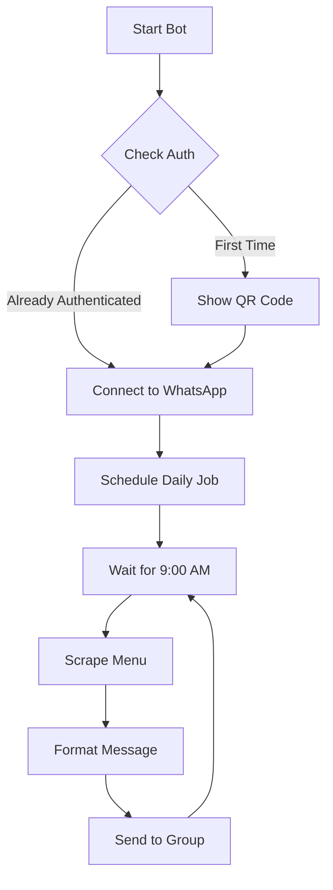

# Ulutek Menu Bot

A WhatsApp bot that automatically fetches and sends the daily menu from Ulutek's website to a specified WhatsApp group.

## 🌟 Features

- 🔄 Automatically fetches daily menu from Ulutek's website
- 📱 Sends menu to a specified WhatsApp group
- 🔌 Persistent WhatsApp connection (only need to scan QR code once)
- 🚀 Auto-startup with Windows
- 📅 Shows menu items with calories
- 🔄 Auto-reconnect on connection loss
- ⏰ Scheduled sending at 9:00 AM on weekdays
- 📊 Calorie tracking for each item

## 📋 Example Menu Format

```
📅 Pazartesi, 29 Ocak 2024
🍽️ Today's Menu:

🥣 Fesleğenli Domates Çorba (161 kcal)
🍖 Etli Ali Nazik (315 kcal)
🥗 Tavuklu Sultan Kebabı (390 kcal)
🍚 Arpa Şehriye Pilavı (456 kcal)
🍰 Tatlı Günü (0 kcal)

Total Calories: 1322 kcal
```

## 🛠️ Setup Instructions

### Prerequisites

1. Node.js installed on your computer
2. A WhatsApp account
3. Member of the target WhatsApp group

### 📥 Installation

1. Clone or download this repository
2. Navigate to the project directory
3. Install dependencies:
   ```bash
   npm install
   ```

### ⚙️ Configuration

1. Create a `.env` file in the project root:
   ```env
   GROUP_JID="your-group-jid-here"
   SCHEDULE_TIME="09:00"
   ```

2. Start the bot for the first time:
   ```bash
   npm start
   ```

3. Scan the QR code that appears in terminal:
   ```
   ▄▄▄▄▄▄▄▄▄▄▄▄▄▄▄▄▄▄▄▄▄▄▄▄
   █ ▄▄▄▄▄ █▀█ █▄█▄█ ▄▄▄▄▄ █
   █ █   █ █▀▀▀█ ▀█ █   █ █
   █ █▄▄▄█ █▀ █▀▀█ █▄▄▄█ █
   █▄▄▄▄▄▄▄█▄▀ ▀▄█▄▄▄▄▄▄▄█
   ▄▄▄▄▄▄▄▄▄▄▄▄▄▄▄▄▄▄▄▄▄▄▄▄
   ```

4. The bot will show available groups:
   ```
   Available WhatsApp Groups:
   ============================
   Group Name: Ulutek Yemek
   Group JID: 123456789-123456@g.us
   ----------------------------
   ```

5. Copy your group's JID to the `.env` file

### 🚀 Auto-Start Setup

1. The `start-bot.bat` file is included in the project
2. To enable auto-start:
   ```
   Windows + R → shell:startup → Copy start-bot.bat here
   ```

## 📊 How It Works



## 🔍 Troubleshooting

Common issues and solutions:

| Issue | Solution |
|-------|----------|
| Bot disconnects | Will auto-reconnect |
| Need new QR code | Delete `auth_info` folder & restart |
| Menu not sending | Check GROUP_JID in .env |
| No menu found | Verify internet connection |

## 📝 Notes

- 💾 Auth state saved in `auth_info` folder
- 🔄 Only scan QR once unless logged out
- 🚀 Auto-starts with Windows if configured
- 🔗 Menu source: https://ulutek.com.tr/yemek-liste

## 🆘 Support

If you encounter any issues:
1. 📋 Check troubleshooting section
2. ⚙️ Verify configuration
3. 📦 Check dependencies
4. 📜 Review console logs

## 🕒 Schedule Details

- ⏰ Runs every weekday at 9:00 AM
- 🚫 Skips weekends automatically
- 🔄 Updates menu daily
- 📅 Handles month transitions
- 🔌 Maintains persistent connection

## 🚀 API Documentation

The bot provides a RESTful API that can be integrated with any system. The API server runs on port 3000 by default.

### Endpoints

#### 1. Health Check
```http
GET /api/health
```
Check if the API and WhatsApp client are running.

**Response**
```json
{
    "status": "ok",
    "clientConnected": true
}
```

#### 2. Initialize WhatsApp
```http
POST /api/init
```
Start the WhatsApp client and show QR code for first-time setup.

**Response**
```json
{
    "success": true,
    "message": "WhatsApp client initialized"
}
```

#### 3. Get Today's Menu
```http
GET /api/menu
```
Fetch today's menu from Ulutek website.

**Response**
```json
{
    "success": true,
    "menu": "📅 Pazartesi, 29 Ocak 2024\n🍽️ Today's Menu:\n..."
}
```

#### 4. Send Menu to Group
```http
POST /api/send-menu
```
Send and pin today's menu to a WhatsApp group.

**Request Body**
```json
{
    "groupId": "123456789@g.us"  // Optional, uses .env GROUP_JID if not provided
}
```

**Response**
```json
{
    "success": true,
    "message": "Menu sent and pinned successfully"
}
```

#### 5. List Available Groups
```http
GET /api/groups
```
Get a list of all WhatsApp groups the bot is part of.

**Response**
```json
{
    "success": true,
    "groups": [
        {
            "id": "123456789@g.us",
            "name": "Ulutek Yemek",
            "participants": 50
        }
    ]
}
```

#### 6. Start Scheduler
```http
POST /api/scheduler/start
```
Start the automatic menu sending scheduler.

**Response**
```json
{
    "success": true,
    "message": "Scheduler started"
}
```

### PHP Integration Example

```php
<?php
// Configuration
$API_BASE = 'http://localhost:3000/api';

// Helper function for API calls
function callApi($endpoint, $method = 'GET', $data = null) {
    $ch = curl_init($API_BASE . $endpoint);
    
    if ($method === 'POST') {
        curl_setopt($ch, CURLOPT_POST, 1);
        if ($data) {
            curl_setopt($ch, CURLOPT_POSTFIELDS, json_encode($data));
        }
    }
    
    curl_setopt($ch, CURLOPT_RETURNTRANSFER, true);
    curl_setopt($ch, CURLOPT_HTTPHEADER, ['Content-Type: application/json']);
    
    $response = curl_exec($ch);
    curl_close($ch);
    
    return json_decode($response, true);
}

// Example usage
try {
    // Check health
    $health = callApi('/health');
    
    // Initialize if not connected
    if (!$health['clientConnected']) {
        $init = callApi('/init', 'POST');
    }
    
    // Get today's menu
    $menu = callApi('/menu');
    
    // Send to group
    $send = callApi('/send-menu', 'POST', [
        'groupId' => '123456789@g.us'
    ]);
    
    echo "Menu sent successfully!";
} catch (Exception $e) {
    echo "Error: " . $e->getMessage();
}
?>
```

### Error Handling

All endpoints follow the same error response format:

```json
{
    "success": false,
    "error": "Error message description"
}
```

Common HTTP status codes:
- `200`: Success
- `404`: Resource not found
- `500`: Server error

### Notes

- The API uses CORS and accepts JSON requests
- WhatsApp client is initialized automatically when needed
- Authentication can be added if required
- All endpoints return JSON responses
- The scheduler runs at 9:00 AM on weekdays by default 